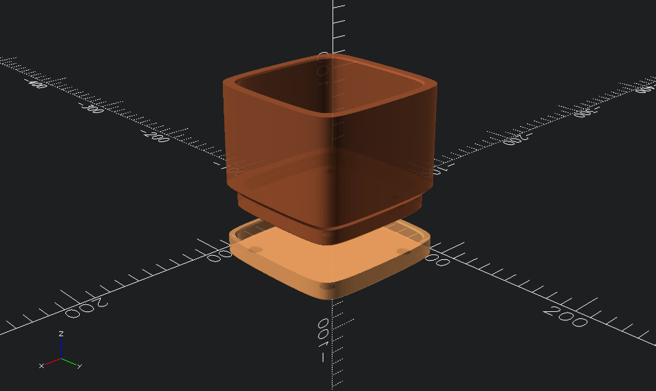

# Parametric Cubic Planter

[](https://openscad.org)

A minimalist parametric OpenSCAD design for a cubic planter with drainage holes and matching drip saucer.

<p align="center">
  
</p>

## Features

- **Squircle profile**: Smooth superellipse shape (customizable squareness)
- **Stepped foot**: Planter base slots into saucer for a flush, integrated look
- **4-corner drainage**: 8mm holes positioned for optimal water flow
- **Matching saucer**: Drip tray with raised lip and rubber feet recesses
- **Print-friendly**: No supports required, all overhangs are chamfered

## Dependencies

Requires [BOSL2 library](https://github.com/BelfrySCAD/BOSL2) for the squircle shape.

## Quick Start

1. Open `planter.scad` in OpenSCAD
2. Use the Customizer panel (View → Customizer) to adjust parameters
3. Preview with F5, render with F6
4. Export STL via File → Export → Export as STL

## Parameters

### Main Dimensions
| Parameter | Default | Description |
|-----------|---------|-------------|
| `size` | 100mm | Outer width/depth of the planter |
| `height` | 80mm | Outer height of the planter |
| `wall_thickness` | 8mm | Wall thickness |
| `base_thickness` | 6mm | Bottom thickness |

### Squircle Shape
| Parameter | Default | Description |
|-----------|---------|-------------|
| `squareness` | 0.65 | Shape blend (0=circle, 1=square) |

### Drainage
| Parameter | Default | Description |
|-----------|---------|-------------|
| `drainage_hole_diameter` | 8mm | Diameter of each drainage hole |
| `drainage_hole_inset_ratio` | 0.2 | Inset from corners as ratio of size |

### Edge Treatments
| Parameter | Default | Description |
|-----------|---------|-------------|
| `chamfer_size` | 1mm | Exterior base chamfer size |
| `draft_angle` | 1° | Interior wall angle for easier de-potting |

### Saucer
| Parameter | Default | Description |
|-----------|---------|-------------|
| `include_saucer` | true | Whether to render the drip saucer |
| `feet_hole_diameter` | 9.525mm | Rubber feet hole diameter (3/8") |
| `feet_hole_inset` | 12mm | Feet hole inset from corners |
| `saucer_clearance` | 1mm | Gap between planter foot and saucer |
| `saucer_lip_height` | 8mm | Height of water-containing lip |
| `saucer_base_thickness` | 4mm | Saucer floor thickness |
| `saucer_wall_thickness` | 4mm | Saucer wall thickness |
| `lip_gap` | 2mm | Vertical gap between saucer lip and planter shoulder |

### Display
| Parameter | Default | Description |
|-----------|---------|-------------|
| `planter_seated` | false | Show planter seated in saucer |
| `assembly_spacing` | 20mm | Gap when not seated (exploded view) |

## STL Files

Pre-built STL files with default parameters are included in `exports/`:
- `exports/planter-body.stl`
- `exports/saucer.stl`

**To regenerate with custom parameters:**

CLI export:
```bash
openscad -o exports/planter-body.stl exports/planter-body.scad
openscad -o exports/saucer.stl exports/saucer.scad
```

GUI export:
1. Comment out `assembly();` at the bottom of `planter.scad`
2. Uncomment `planter_body();` or `saucer();`
3. Render (F6) and export STL

## Print Settings (Recommended)

- **Layer height**: 0.2mm
- **Infill**: 15-20%
- **Walls**: 3-4 perimeters
- **Supports**: Not required
- **Material**: PLA, PETG, or ASA (for outdoor use)

## Dimensions Summary

With default settings:
- **Planter outer**: 100 × 100 × 80mm
- **Planter inner cavity**: 84 × 84 × 74mm
- **Saucer outer**: 100 × 100 × 12mm

